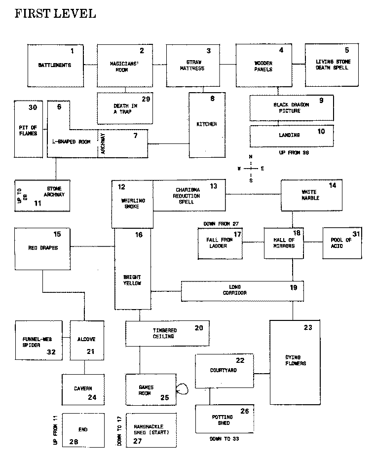
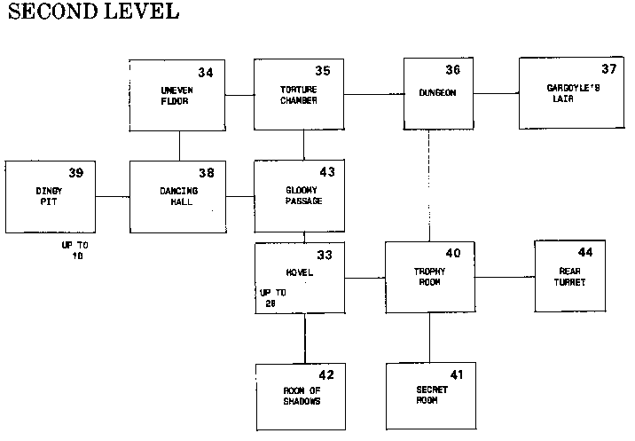

21 THE ANCIENT CHATEAU
======
With our final Adventure we break new ground.

This program, which is around 26K long, takes place in a deserted medieval castle in France. The name of the castle is real, all else is imaginary.

Puzzles
-------
In the final chapter of the book, we discuss a number of ways you can increase the level of interest in an Adventure. One way is to have puzzles which the player must solve before continuing. In this program, the puzzle concerns a dwarf, who is going to make sure that if you stumble into the room where he lives, you will not be able to leave, unless you manage to hit the one thing that will enable you to continue.

There are two locked doors, with keys a long way away from the relevant rooms, and as you've experienced before, you must have the right key for the right lock.

Two-Word Sentences
--------
The main difference between this Adventure and the others in the book, is that in this one the computer is given the facility of understanding English-at least appearing to do so.

The computer is programmed to recognize and act on two-word sentences. The two words must be a verb first, followed by a noun. The computer, for example, can understand the instruction GO NORTH (or even RUN NORTH, MOVE NORTH, CLIMB NORTH, or WALK NORTH). You'll find it is far more satisfying to "talk" to your computer in this way than it is to communicate simply by touching a key.

As was pointed out at the start of the book, some of the pleasure of Adventure programs comes from trying to work out which words it will understand, and which it will reject.

All the objects you encounter within the chateau can be manipulated-at least to the extent of being picked up or put down. Some objects (such as the MYSTIC SCROLL) can be read and others can be drunk. As you can tell from this, the vocabulary handling is quite extensive.

Snapshots
---------
Let's see a little bit of it in action, before I describe how it works. Here's the opening frame:
```
You begin this Adventure in a small wood
outside the Chateau...

While out walking one day, you come
across a small, ramshackle shed in
the woods. Entering it, you see a
hole in one corner...an old ladder
leads down from the hole...

Your attributes are:
   Strength - 11   Charisma - 7
   Dexterity - 10   Intelligence - 11  
   Wisdom - 9   Constitution - 7

What do you want to do? GO DOWN
```
As you can see, you have the six attributes you possessed in earlier Adventures. You'll see that these are slowly reduced as you make your moves. You must find the exit from the chateau before any of them is cut right down to zero.

The computer accepts your two-word command GO DOWN and then informs you that there is no way back:
```
As you stumble down the ladder
you fell into the room. The ladder
crashes down behind you...there
is now no way back...
A small door leeds east from
this very cramped room...

Your attributes are:
   Strength - 10   Charisma - 7
   Dexterity - 10   Intelligence - 10  
   Wisdom - 9   Constitution - 6

What do you want to do? MOVE EAST
```
Obviously, it is sink or swim from now on. You must find the exit from the chateau, or die within its walls. After you MOVE EAST, you enter the Hall of Mirrors, which not only contains copper pieces, but also that well-known horror, a "Giolla Dacker."
```
You find yourself in a Hall of
Mirrors...and see yourself
reflected a hundred times or
more...through the bright glare
you can make out doors in all
directions...You notice the
mirrors around the east door
are heavily tarnished...

  YOU CAN SEE COPPER PIECES

  LOOK OUT!
THERE IS A GIOLLA DACKER HERE!

Your attributes are:
   Strength - 10   Charisma - 7
   Dexterity - 10   Intelligence - 10  
   Wisdom - 9   Constitution - 6
You decide that money comes ahead of conflict in your scale of values:

What do you want to do? GET COPPER
```
Having picked up the coins, you decide it is time to flee, so when asked what you want to do, you enter RUN. But the computer will have none of it:
```
You are carrying:
   COPPER PIECES
       Total value - $ 27

What do you want to do? RUN
RUN     IS JUST ONE WORD
   I NEED TWO
So you decide to comply, and enter two words:

What do you want to do? RUN SOUTH
```
As in the earlier Adventures, you are not stuck permanently with something simply because you have picked it up:
```
The scent of dying flowers fills
this brightly-lit room...

There are two exits from it..

Your attributes are:
   Strength - 7   Charisma - 2
   Dexterity - 8   Intelligence - 7  
   Wisdom - 8   Constitution - 5

You are carrying:
   COPPER PIECES
   EBONY RING
   AMULET
       Total value - $ 440

What do you want to do? DROP COPPER
YOU HAVE DROPPED THE COPPER PIECES
```
The computer is quick to reject input it does not understand:
```
A dried-up fountain stands in the
center of this courtyard, which
once held beautiful flowers...but
have long since died...

Your attributes are:
   Strength - 8   Charisma - 2
   Dexterity - 8   Intelligence - 7  
   Wisdom - 8   Constitution - 5

You are carrying:
   EBONY RING
   AMULET
       Total value - $ 413

What do you want to do? FLY EAST
I DON'T UNDERSTAND 'FLY EAST
```
However, it is worth trying new words, because you never know what it will accept:
```
Through the dim mustiness of
this small potting shed you can
see a stairwell...

Your attributes are:
   Strength - 5   Charisma - 2
   Dexterity - 6   Intelligence - 6
   Wisdom - 8   Constitution - 3

You are carrying:
   MACE
   EBONY RING
   AMULET
   MYSTIC SCROLL
       Total value - $ 608

What do you want to do? READ SCROLL
It says 'THE LOCKS NEED SPECIAL KEYS'
```
I am deliberately not going to tell you too much about CHATEAU GAILLARD, because to do so would rob you completely of the pleasure of playing it. You may well work out some of the puzzles while you are typing it in, but others will not be apparent from the listing. Therefore, I'm leaving you pretty much on your own.

However, this book is intended to share ideas with you which will help you create original Adventure games, so a certain amount of explanation is in order.

Vocabulary Handling
The most important idea introduced in this program is the vocabulary handling which, I hope you'll agree, adds a completely new dimension to the program.
```
360 REM INPUT HANDLING
370 KW=0:REM =1 IF WORD UNDERSTOOD
380 FOR Z=1 TO 1000:NEXT Z
390 INPUT "What do you want to do";A$
400 IF A$="" THEN 390
410 AS=ASC(A$)
420 IF AS<65 OR AS>90 THEN PRINT TAB(3);
">>> CAPITAL LETTERS, PLEASE":PRINT:GOTO 390
```
First, the variable KW (which stands for "key word") is set to zero in line 370. If KW becomes equal to one, then the computer has recognized a phrase it can act on. Line 400 accepts the answer to the question "What do you want to do?" and the following line takes the ASCII code of the first letter of the player's answer. If this is not between 65 and 90, then the player is typing in lower-case letters, so the message from line 420-CAPITAL LETTERS, PLEASE-is triggered, and the program returns to line 390 for a new input.
```
430 M=LEN(A$):IF M<7 THEN A$=A$+" ":GOTO 430
440 B$=LEFT$(A$,3)
450 IF B$="HEL" THEN PRINT "NO HELP FOR
MORTALS IN THIS GAME!":PRINT "...although
reading and drinking":PRINT "may help...":GOTO 40
460 IF B$="QUI" THEN QU=4:GOTO 2530
```
Line 430 sets M equal to the length of the player's input. It cycles through, adding blank spaces, until it is seven characters long. Line 440 then strips off the first three letters. In common with most Adventure programs, only the first three letters of a command must be entered, so WAL will do for WALK, and FIG for FIGHT. Three letters have been found to be sufficient to avoid ambiguity, and it is good to allow the player to simply enter three letters, rather than the whole word, if that is what he or she wants to do.

Line 450 detects the word HELP and gives a cryptic, but useful, reply, then returns to the beginning of the major handling loop in this program.

Line 460 allows the player to QUIT and sends action to the routine which terminates the program, starting at line 2530.

The next section of the program is the most important part of the vocabulary handling routine:
```
470 N=1
480 IF MID$(A$,N,1)=" " THEN C$=MID$(A$,N+1,3):
IF LEFT$(C$,1)<>" " THEN 530 ELSE 500
490 IF N<M THEN N=N+1:GOTO 480
500 IF RND(1)>.5 THEN 520
510 PRINT TAB(6);"BY ITSELF,";A$:PRINT TAB(6);
"CAN'T BE ACTED ON":GOTO 390
520 PRINT A$;" IS JUST ONE WORD":PRINT TAB(4);
"I NEED TWO":GOTO 390
```
Line 480 goes through the player input, character by character, looking for the first space which it knows should occur between words one and two (as between RUN and EAST, or GET and DIAMOND). Having found it, the computer sets C$ equal to the first three letters of the second word, to go with its B$ which it earlier set equal to the first three letters of the first word. If it finds that the first letter of C$ is not a space (second statement in line 480) it knows the player's input was two words, so goes to line 530 to continue processing the input.

Line 490 continues the scan through the input.

The computer comes to line 500 if the scan through the input finishes, and the gap between two words has not been found, or (where it is sent by the ELSE in line 480) it discovers that the first character of C$ is a space.

The RND in line 500 chooses between two replies to tell the player a new input is needed, and then goes back to get a new input.
```
530 IF RO<>8 AND RO<>34 THEN 560
540 IF B$="STA" OR B$="KIL" OR B$= "
FIG" OR B$="KIC" OR B$="PUN" OR
B$="SLA" OR B$="ATT" THEN KW=1:GOSUB 1400
550 IF A(RO,7)>98 AND B$<>"UNL" THEN PRINT
TAB(4);"** The doors are locked **":GOTO 40
560 IF B$="STA" OR B$="KIL" OR B$= "
FIG" OR B$="KIC" OR B$="PUN" OR
B$="SLA" OR B$="ATT" THEN KW=1:GOSUB 1400
570 IF B$="GO " OR B$="MOV" OR B$= "
CLI" OR B$="RUN" OR B$="WAL" THEN
KW=1:GOSUB 740
580 IF B$="TAK" OR B$="GET" OR B$="
STE" OR B$="LIF" THEN KW=1:GOSUB 950
590 IF B$="DRO" OR B$="PUT" OR B$="
THR" OR B$="BRE" THEN KW=1:COSUB 1160
600 IF B$="UNL" THEN KW=1:GOSUB 2360
610 IF BS="OPE" THEN KW=1:GOSUB 2660
620 IF B$="REA" THEN KW=1:GOSUB 2750
630 IF B$="DRI" OR B$="SWA" THEN
KW=1:GOSUB 2870
640 IF B$="BRI" OR B$="PAY" THEN
KW=1:GOSUB 3000
650 IF KW=1 THEN 700
```
Here, now, is the heart of the computer's ability to "understand" the player's wishes. Line 530 checks to see if the player is in room 8 or in room 34, and if not, jumps to line 560. These two rooms are the ones which are locked at the start of the game, and it is important to check to see whether or not they are still locked before the program continues.

Even if the room is locked, it may contain a monster who feels like a fight, and this takes precedence over the need to unlock the door before proceeding. Look carefully at line 540. It allows the following words to be accepted:
```
STA - for STAB
KIL - for KILL
FIG - for FIGHT
KIC - for KICK
PUN - for PUNCH
SLA - for SLAY
ATT - for ATTACK
```
Any one of those will be accepted, and acted upon. You can see that a player who does not know, in advance, which words the computer will accept, should easily find one or two which will allow the machine to carry out his or her wishes.

Line 550 is only acted on if the contents of the room (the seventh element of A array) is a value greater than 98. This means the door is locked. If this is true, and the B$ part of the string does not contain UNL (as in UNLOCK), the computer will just point out that "The doors are locked" and then go back to the start of the major handling routine for a new input.

Line 560 is a repeat of line 540, but this version of it is reached if the player is not in a room with locked (or potentially locked) doors. You'll see, at the end of line 560, that KW (the variable standing, you'll recall, for "key word") is set equal to 1, meaning a word has been recognized. Finding a word meaning "fight" the computer sets KW equal to 1, then goes to the subroutine from line 1400 where the fight takes place.

Line 570 accepts the words for movement, which are GO, MOVE, CLIMB, RUN, and WALK. It goes to the subroutine from 740, where the actual moves between rooms are made.

Line 580 allows the player to pick up things with TAKE, GET, STEAL, and LIFT. The desire to get rid of things is recognized by line 590, which accepts DROP, PUT, THROW, and BREAK (and when it reaches the subroutine from line 1160, prints out a message-such as WITH A CRASH, THE VASE SMASHES AGAINST THE WALL-which is related to the word you chose to use when making your input.

Line 600 is used when you wish to UNLock the door, 610 if you are OPEning something (such as the chests which litter the place), 620 for REAding, 630 for DRInking or SWAllowing, and line 640 for.... But I'm not going to tell you. It was hinted at a little earlier, and I'm not going to repeat the hint. Far better that you have the pleasure of working it out for yourself.

You'll recall that there was a section of code which rejected single word inputs. You'll also recall that the variable KW was to be set to 1 if a word the computer could understand was found. If the computer finds, at line 650, that KW equals 1, then it knows all is probably well. If it does not, the next section of code comes into play:
```
660 R=INT(RND(1)*3)
670 IF R=0 THEN PRINT "IT WOULD NOT BE WISE TO ";A$
680 IF R=1 THEN PRINT "ONLY A FOOL WOULD TRY TO ";A$
690 IF R=2 THEN PRINT "I DON'T UNDERSTAND '";A$
700 FOR Z=1 TO 500:NEXT Z
710 GOTO 40
720 REM * END OF MAJOR HANDLING LOOP *
```
The player gets to this section if he or she has entered a two-word phrase, but it is not one which the computer can understand. All obscene entries, often the input of very frustrated players, end up here. The computer chooses one of the three replies, each of which uses the phrase entered by the player, echoing back any rude words. After a pause (line 700) the program returns to the beginning of the major handling routine.

All other parts of this program are simply developments of ideas discussed earlier in the book. You will find that, with the knowledge you've gathered so far in your reading, you should have little trouble in working out how each section works.

The full program listing is given in the next chapter. You'll see that rows of asterisks mark off each section, and REM statements introduce the major routines.

The Map
-------
The map is relatively complicated, as you can see. I suggest you try very hard not to look at it, until you've attempted to map the dungeon yourself.




